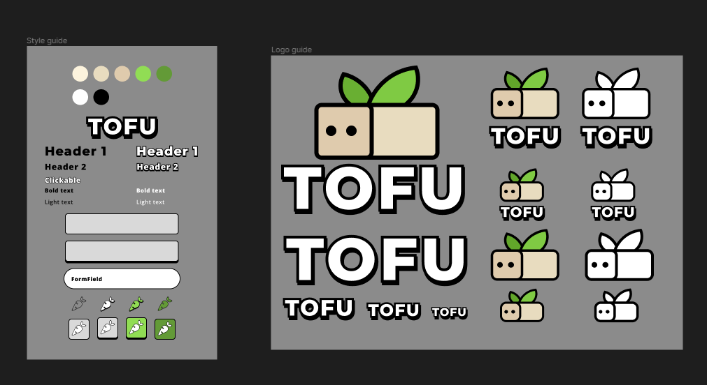
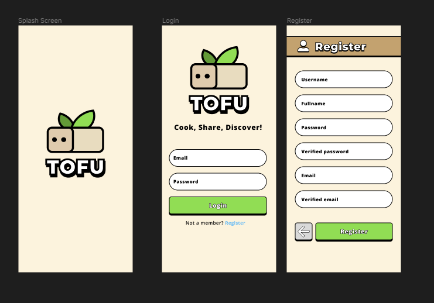
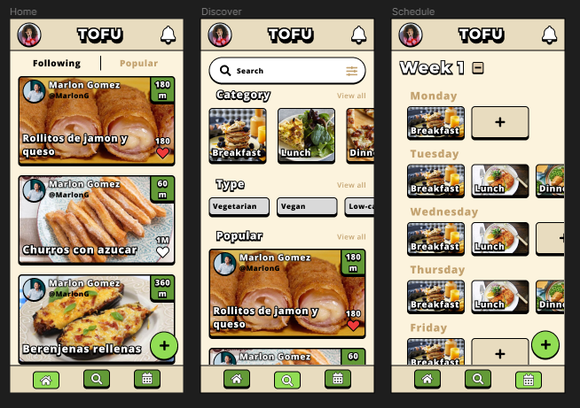
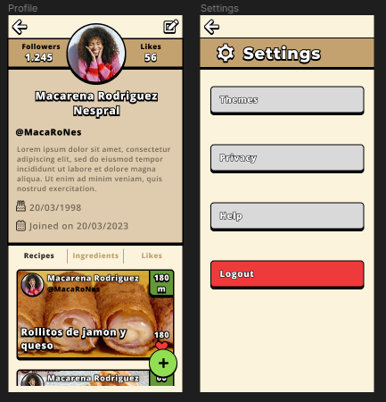
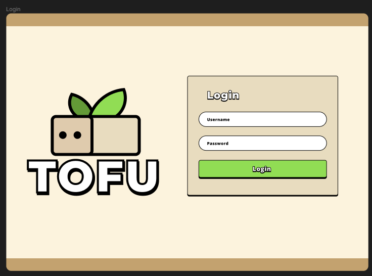
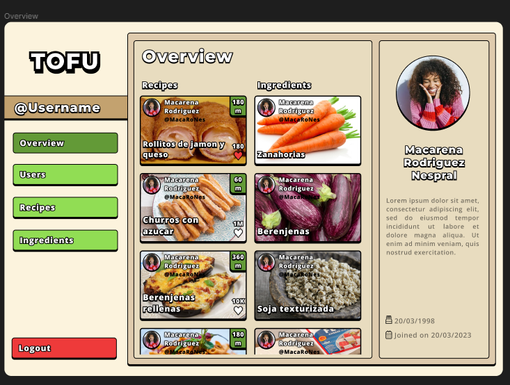
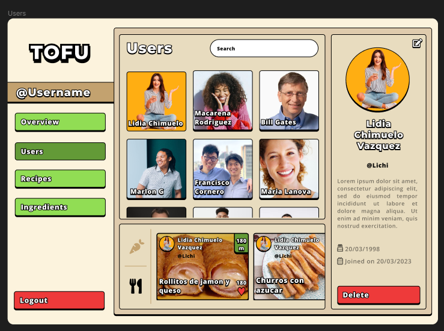
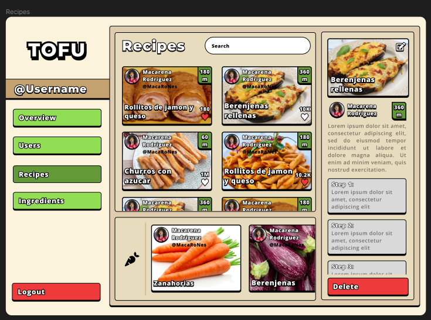
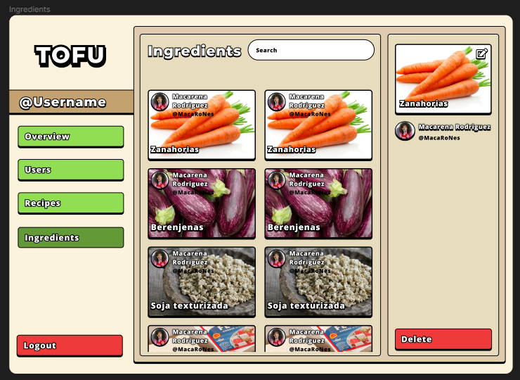
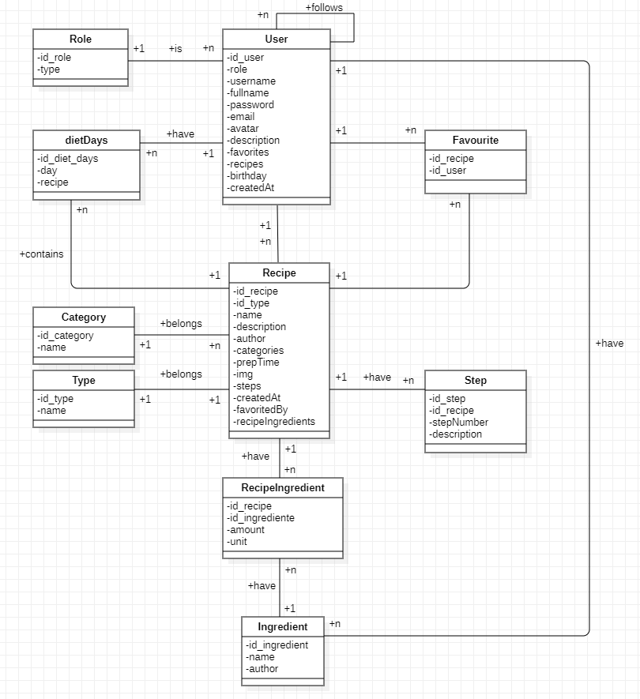

# 1. Introduccion

Tofu App es una aplicación desarrollada para android con la intencion de poder compartir tus recetas favoritas, descubrir nuevas recetas de otros usuarios con las que experimentar y planificar tu semana, sabiendo que alimentos necesitas previamente.

# 2. Plan de Empresa

## Justificacion

Esta aplicacion surge de la necesidad de una aplicacion con la que compartir recetas, descubrir otras nuevas y poder planificarte la semana conociendo que alimentos son necesarios.

Como ejemplo de aplicaciones que podrian ser competencia, estan Cookpad, MyRecipeBox, o aplicaciones parecidas de recetarios.

En nuestro caso, al querer tambien que tenga un componente social, esta acaba diferenciandose de estas, ademas de tener un apartado para planificarte la semana, y ver que alimentos necesitas para la lista de la compra de esa semana.

En el apartado social, hay varias aplicaciones en las que uno puede fijarse como Instagram o Twitter.

## Nombre y logo

La aplicacion se llamara Tofu, principalmente por distinguirse en el mercado, ya que la mayoria tienen nombres directamente relacionado directamente con las receta (Recipe... , cook... o parecidos)

El significado que se le da a este nombre se basa en que es un nombre corto, que sonoramente esta bien y que es un alimento con muchos usos diversos en la cocina vegetariana y vegana. Ademas de ello, al yo ser vegetariano, le doy tambien un significado propio que lo hace algo mas especial.

En cuanto a la estetica del logo, se busca algo desentendido, con una estetica entre el neo-brutalismo y un estilo cartoon/comic con bordes redondeados.

## Producto

## Modelo de negocio

En cuanto al modelo de negocio, constara con un modelo de suscripcion que te dara ciertas ventajas extras, como el poder planificar mas de una semana o tener diferentes tematicas para la aplicacion y asi hacerla mas personalizable

## Consumidores y posibles clientes

Principalmente el tipo de consumidores sera gente con intereses en la cocina, sin necesidad de llegar a ser profesionales, y que quieran compartir y descubrir nuevas recetas, ademas de personas que tengan interes en la salud y el bienestar y quieran conocer recetas categorizadas de diferentes formas convenientes (Vegetariana, de bajos carbohidratos, para celiacos..., super-proteica)

## Competencia

Como ha sido mencionado anteriormente hay dos tipos de posibles competencias, o empresas en las que poder fijarse:

- Redes sociales: Instagram, twitter, facebook, reddit...

- Recetarios: Cookpad, MyRecipeBox...

## DAFO

**Debilidades**: Es una aplicacion para un tipo de gente algo concreta

**Amenazas**: Que no termine de cubrir las necesidades que se plantean y no llegue al publico necesario

**Fortalezas**: El ambito social puede ser clave junto al poder organizarse

**Oportunidades**: Mucha gente joven busca facilidades a la hora de organizar comidas cuando empiezan a independizarse

## Publicidad y Promocion

Promocion principalmente entre gente conocidas, y contactos por Twitter que muevan numeros medianamente amplios.

En caso de que la aplicacion empezase a recaudar ingresos se promocionaria por diversas redes sociales (Tiktok, twitter, youtube...) y se buscaria hacer colaboraciones/anuncios pagados a creadores de contenido que traten temas semejantes (nutricion, deporte, organizacion...)

Por ultimo se buscarian crear anuncios propios para distribuirlos por internet

# 3. Descripcion detallada e historias de usuario

En la aplicacion el usuario primeramente se logeara, o en caso de no tener ningun usuario o contraseña, tendra la opcion de registrarse mediante un formulario que le pedira un nombre de usuario, su nombre completo, su email con comprobante de que no se equivoca, y una contraseña con otro comprobante para demostrar que no se equivoca. 

Una vez se tiene ya el usuario, este podra entrar en la aplicacion. En ella se vera que esta dividida en tres pantallas. 

Primero esta la pantalla de inicio, en la cual podra observar varias recetas subidas por otras personas. Esta pantalla puede cambiarse para ver recetas de gente a la que estas siguiendo o recetas populares de todo el mundo. Si se le da click a alguna de las recetas, se podra ver con mas detalle de que trata esta receta, con una lista de ingredientes, una descripcion breve de la receta, y una lista de los pasos a seguir, ademas de los datos ya vistos como lo son el nombre, el tiempo que se tarda en hacer, la categoria de la receta, el tipo de plato, los likes que recibio la receta, y el autor de esta. Por ultimo, tambien se pueden crear recetas o ingredientes desde esta pantalla, dando click a un boton que te llevara a un formulario con todos los datos necesarios para crearla.

La segunda pantalla que se puede ver es la pantalla de descubrir, a la cual se accede a traves del boton de lupa del navbar de abajo. En esta se puede usar un buscador para encontrar recetas por el nombre o ingrediente, otras personas a las que seguir, o ingredientes que puedan interesarte. Ademas de ellos cuenta con varios botones o listas para poder filtrar de mejor forma las recetas que te interesen, desde poder filtrarlas por categoria, tipo de platos o tiempo que necesita.

La ultima pantalla es la pantalla de calendario, en la cual puedes añadir diversos planing semanales a tu calendario, para poder organizar las comidas de cada dia. Estos se organizan segun el tipo de plato, desde el mismo desayuno hasta la cena, o incluso snacks u otro tipo de platos.

Ademas de estas tres pantallas tambien se puede acceder a tu perfil personal desde el boton desplegable de la izquierda con tu avatar. Al pulsar este se despliega un menu que te permite seleccionar entre las settings de la aplicacion o ver el perfil tuyo. 

Si le das a ver el perfil personal, podras ver tu perfil, con una lista de tus recetas, ingredientes, y todos los likes que has dado, ademas de ver tu descripcion, el numero de seguidores que tienes, y el numero de likes que has dado a otras recetas. Tambien se muestran algunos datos mas como lo son el cumpleaños, y la fecha de creacion de la cuenta.

Si por otro lado le das al boton de opciones o settings, podras acceder a un menu en el que tendras varias opciones, entre ellas la opcion de tematica, de privacidad, de ayuda, y de cerrar sesion.

En la opcion de tematica se mostraran diversas tematicas de colores para decorar la aplicacion a gusto del usuario, de tal forma que pueda personalizar la aplicacion como quiera.

En la opcion de privacidad, se encuentra la opcion de cambio de contraseña, ademas de la opcion de borrar tu cuenta definitivamente. Esto no solo borrara tu cuenta, si no que todas las recetas o ingredientes que hayas subido tambien se borraran, dejando cero rastro de tu cuenta.

En la opcion de Ayuda, se encontrara una descripcion de la empresa, e informacion sobre como contactar con la empresa en caso de algun problema.

Por ultimo, en la opcion de logout, o de cerrado de sesion, al pulsarlo se preguntara si estas seguro de que quieres cerrar la sesion, y al aceptar se cerrara, devolviendote al Login de la aplicacion.

# 4. Modelo y diseño

### 4.1.1 Prototipado figma Movil

### 4.1.2 Prototipado figma Web

### 4.2 Diagrama de clases del modelo dominio de la API

# 5. Diseño

